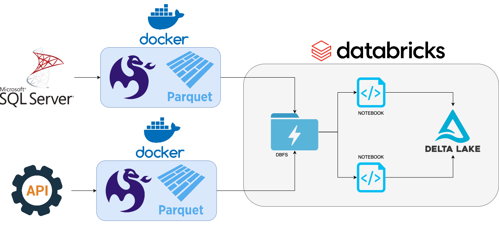

# -LH20253-Entrega-do-Desafio-2

# Projeto de Extração de Dados da Empresa Adventure Works

## Visão Geral do Projeto

Este projeto automatiza o processo de extração de dados de uma API e do banco de dados AdventureWorks, transformando-os e carregando-os em tabelas no formato Delta no Databricks. Todo o fluxo é orquestrado e executado dentro de container Docker, utilizando a ferramenta Meltano para extração e a ferramenta Databricks CLI para gerir todo processo dentro do Databricks garantindo um ambiente consistente e reprodutível.

## Funcionalidades

*   **Extração de Dados**: Utiliza o Meltano para coletar dados de uma API e do banco de dados AdventureWorks.
*   **Carregamento**: Os dados extraídos são processados e convertidos em tabelas Delta no Databricks, otimizando-os para análise e consumo.
*   **Automação Completa**: O processo é totalmente automatizado através de um `entrypoint` no container Docker, eliminando a necessidade de intervenção manual após a inicialização.
*   **Ambiente Isolado**: O uso de Docker garante que todas as dependências e configurações sejam encapsuladas, facilitando a execução em diferentes ambientes.

## Tecnologias Utilizadas

*   **Meltano**: Ferramenta de ELT (Extract, Load, Transform) para orquestração de pipelines de dados, utilizada para a extração dos dados.
*   **Databricks**: Plataforma de engenharia de dados e machine learning, utilizada para receber os arquivos, transformá-los e armazená-los em no formato Deltalake 
*   **Docker**: Tecnologia de conteinerização para empacotar o projeto e suas dependências, garantindo um ambiente de execução consistente.

## Estrutura do Projeto 

```text 
├── data
    ├── extract_from_api
    ├── extract_from_db
├── meltano-api
    ├── tap-adventureworkapi
    ├── Dockerfile
├── meltano-db
    ├── Dockerfile
├── scripts
├── img
└── README.md
``` 


## Visão geral do projeto




## Instalação e configuração 

O projeto foi estruturado para rodar via conteiner no Docker e está dividido em 2 semi projetos distintos, meltano-api e meltano-db, a instalação de ambos seguem a mesma lógica, porém eles rodam em em processos isolados. 

Para executar este projeto, você precisará ter o Docker instalado em sua máquina. 

1. **Clone o Repositório:**
```bash
git clone https://github.com/MarcioFernandesIndicium/LH20253-Entrega-do-Desafio-2.git 
cd LH20253-Entrega-do-Desafio-2
```

2. **Configurar Variáveis de Ambiente (Importante):**

Para rodar este projeto é necessário credenciais para a API, o banco de dados AdventureWorks e o Databricks. É **altamente recomendável** que você utilize variáveis de ambiente para gerenciar essas credenciais. Crie um arquivo `.env` na raiz do projeto usando o arquivo `.env.example` como base (você irá encontrar um arquivo `.env.example` tanto no diretório meltano-api quanto no meltano-db com a respectivas configurações)

*Lembre-se de não commitar o arquivo `.env`para o controle de versão (adicione-o ao `.gitignore`).*


3. **Criando e executando o Container Docker `meltano-api`**

Navegue até o diretório `meltano-api\tap-adventureworkapi`  onde o `Dockerfile` está localizado e execute o comando no terminal:

```bash
docker build -t meltano-api .
```

Aguarde a conclusão e execute o comando: 

```bash
docker run --rm --env-file .env -it  -v $(pwd)/../../data/extract_from_api:/data/extract_from_api meltano-api
```

Este comando executa o container a partir da imagem construída, passando as variáveis de ambiente do arquivo `.env`, assim como atribui um diretório local na sua máquina onde a extração acontecerá. 

Após a execução do comando `docker run`, o `entrypoint.sh` será automaticamente acionado, iniciando o pipeline de extração e carregamento de dados. Você poderá acompanhar o progresso através dos logs no terminal.

Caso queria executar cada etapa descrita no `entrypoint.sh` manualmente, basta abrir o terminal docker em modo interativo, e digitar os comandos conforme faria em sua máquina, para isso, execute o comando: 

```bash
docker run --env-file .env -it  -v $(pwd)/../../data/extract_from_api:/data/extract_from_api meltano-api bash
``` 


4. **Criando e executando o Container Docker `meltano-db`**

Navegue até o diretório `meltano-db`  onde o `Dockerfile` está localizado e execute o comando no terminal:

```bash
docker build -t meltano-db .
```

Aguarde a conclusão e execute o comando: 

```bash
docker run --rm --env-file .env -it  -v $(pwd)/../data/extract_from_db:/data/extract_from_db meltano-db
```

Este comando executa o container a partir da imagem construída, passando as variáveis de ambiente do arquivo `.env`, assim como atribui um diretório local na sua máquina onde a extração acontecerá. 

Após a execução do comando `docker run`, o `entrypoint.sh` será automaticamente acionado, iniciando o pipeline de extração e carregamento de dados. Você poderá acompanhar o progresso através dos logs no terminal.

Caso queria executar cada etapa descrita no `entrypoint.sh` manualmente, basta abrir o terminal docker em modo interativo, e digitar os comandos conforme faria em sua máquina, para isso, execute o comando: 

```bash
docker run -it --env-file .env -v $(pwd)/../data/extract_from_db:/data/extract_from_db meltano-db bash
```


## Configurações Avançada

*   **Meltano**: Para adicionar novas fontes de dados (taps) ou destinos (targets), edite o arquivo `meltano.yml`. Consulte a [documentação do Meltano](https://docs.meltano.com/ ) para mais detalhes.

É possivel escolher manualmente os `endpoints` que quer extrair tanto da API quanto do banco de dados da Adventure Works, para isso, procure o arquivo `meltano.yml` dentro dos respectivos diretórios, e comente todas as linhas que **não** quer realizar a extração, como exemplo abaixo: 

```yaml
select:
    - Sales-Currency.*
    - Sales-Customer.*
    - Sales-CountryRegionCurrency.*
    - Sales-CreditCard.*
    # - Sales-CurrencyRate.*
    # - Sales-PersonCreditCard.*
    # - Sales-SalesOrderDetail.*
    # - Sales-SalesOrderHeader.*
    # - Sales-SalesOrderHeaderSalesReason.*
    # - Sales-SalesPerson.*
    # - Sales-SalesPersonQuatoHistory.
```

*Sempre que alterar o arquivo `meltano.yml` não esqueça de criar a imagem Docker novamente através do `docker build`.*


*   **Databricks**: As transformações e o esquema das tabelas Delta são definidos nos scripts Python através de notebooks dentro do Databricks. Certifique-se de que seu ambiente Databricks esteja configurado para receber os dados e que as permissões de acesso estejam corretas.

No projeto você encontrará um diretório `scrips` e nele terá um modelo base do notebook usado no databricks, sinta-se a vontade para utiliza-lo, basta substituir os parâmetros para o caminho correto no seu databricks

```python
dbutils.widgets.text("catalog", "", "Catalog")
dbutils.widgets.text("schema", "", "Schema")
dbutils.widgets.text("volume", "", "Volume")
dbutils.widgets.text("source_folder", "", "Source Folder")
```

*No Databricks será necessário a criação de um job com a função de rodar o notebook criado, para mais informações sobre "JOBS" consulte as instruções da [documentação do Databricks](https://docs.databricks.com/aws/pt/jobs/jobs-quickstart).

Siga as instruções para criação do job: 

* Na plataforma do Databricks, vá na guia `Execução de jobs` e clique em `criar job`
* De um nome para a tarefa. ex: executar_notebook
* Escolha o tipo `notebook`
* Origem: Espaço de trabalho 
* Caminho: O caminho onde seu notebook está salvo. 
* Compute: Serveless ou o cluster de sua preferência. 
* Clique em `criar tarefa` e copie o id do job. 

No `entrypoint.sh` altere o id no comando: 

```bash
databricks jobs run-now <COLOQUE AQUI SEU ID> 
```

Feito essas alterações, seu projeto está todo configurado para realizar a extração e carga dos dados provenientes da API e banco de dados da Adventure Works de maneira automatizada. 


## Contribuição

Sinta-se à vontade para contribuir com este projeto. Para isso, siga os passos:

1.  Faça um fork do repositório.
2.  Crie uma nova branch (`git checkout -b feature/minha-nova-feature`).
3.  Faça suas alterações e commite-as (`git commit -m 'Adiciona nova feature'`).
4.  Envie para a branch original (`git push origin feature/minha-nova-feature`).
5.  Abra um Pull Request.

